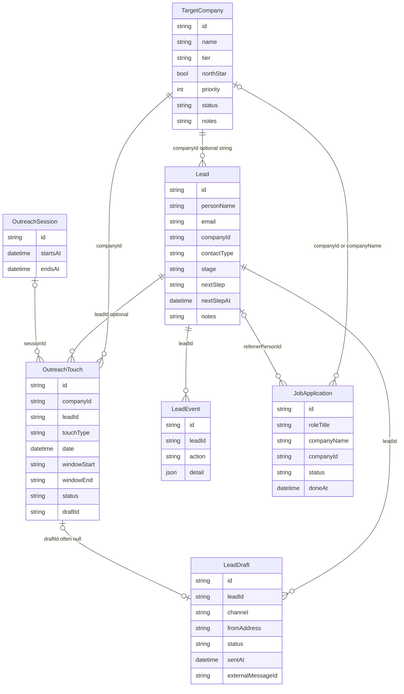
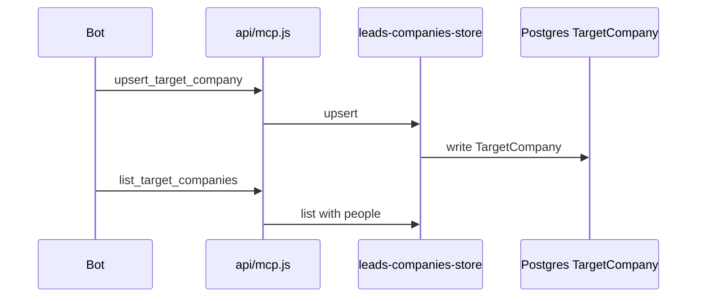
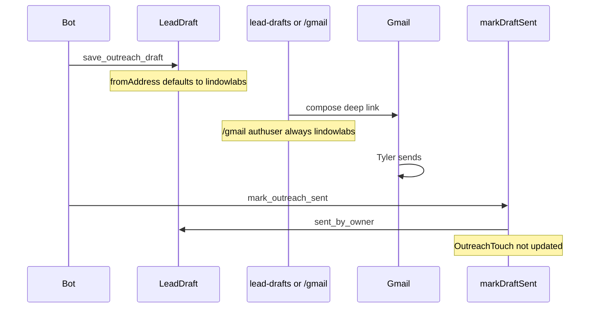
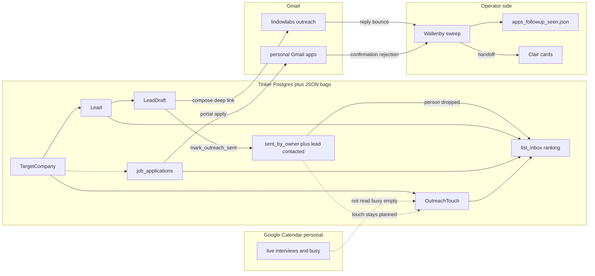

# Tinker 1 of 3: Current architecture (as built today)

## 1. Purpose and baseline

This document describes **tinker main as built today**. It focuses on the **data model** and the **flow of information** for the job-search operations Tinker models.

Baseline: `beginner-work/tinker` branch `main`, commit `025a5da49361fef2a83daa986c41cdf9227aa404` ("Fix mcp-keys syntax after #412 merge conflict", 2026-10-01). Claims below were checked against that tree. Live data counts, Gmail, Google Calendar, and the operator follow-up file are not in the repo; those are labeled **operator-confirmed (Oct 1, 2026)** or **Unverified**.

This revision is today only. It has no proposals and no recommendations. The proposed opportunity-centred model is covered in Doc 2.

Sources folded in: Wallenby's domain brief (sections 1 to 6, Oct 1, 2026), Bón / Clair / Wallenby LL-77 review notes and addendum (Oct 1, 2026), and code on main. The plain-text export of the prior Google Doc was not readable in this environment (sign-in page only), so accurate content from that doc was rebuilt from the brief, review notes, and code.

PR #419 (`npm run check`, loop-log, copilot-instructions) is **open and not merged** as of this write. Items that arrive only with that PR stay marked not yet on main.

---

## 2. Glossary

| Term | Ops meaning | Where it lives today |
|---|---|---|
| **Company** | An employer Tyler is targeting. Has priority, wave (North Star, wave 1, wave 2, other), and fit notes. | `TargetCompany` in Postgres (`prisma/schema.prisma`, `api/_lib/leads-companies-store.js`). `tier` holds the wave; `northStar` is a flag; `status` is `active` or `dropped`. |
| **Role / opportunity** | One posting at a company (to apply, applied, AI interview, rejected, and so on). | **No single entity.** Split across: (a) `job_applications` JSON in `TinkerUserData` (`api/_lib/job-application-store.js`); (b) free text on the person (`Lead.targetRoleTitle`, `Lead.postingUrl`, `nextStep`); (c) prose in `TargetCompany.notes`. Older roles can live only in Gmail and the operator follow-up file (**operator-confirmed**). |
| **Person** | A human at a company: recruiter, EM / hiring leader, referrer, or peer. | `Lead` (`api/_lib/leads-store.js`). `contactType` is `referrer`, `recruiter`, `hiring_leader`, or `other`. **Peer has no enum value**; peers fall under `other`. One `companyId` and one `contactType` per row. |
| **Send / touch** | Ops: one outbound message from a mailbox. Tinker: a planned slot on the outreach calendar. | Two records: `LeadDraft` (message text, `sent_by_owner`, `sentAt`) and `OutreachTouch` (planned slot: `touchType`, `date`, status). Linked only by `OutreachTouch.draftId`. Actual send happens in Gmail. |
| **Reply** | The person answered. | **Not captured by Tinker.** Stage `replied` is set by hand. Replies live in Gmail. The operator file records `reply` flags (**operator-confirmed**). |
| **Bounce** | Delivery failure, or a no-reply address with no human. | **Not in Tinker.** `mark_outreach_failed` covers only approved drafts that failed to send (`leads-store.js:markDraftFailed`). Operator file records `bounce` and `fallback` (**operator-confirmed**). |
| **Follow-up** | Next nudge after silence or after a step. | Partly in Tinker: touch types `referral_follow_up` and `call_follow_up` (`outreach-schedule-store.js:TOUCH_TYPES`), plus `Lead.nextStep` / `nextStepAt`. No dedicated no-reply touch type. Due windows and checkpoints live in the operator file (**operator-confirmed**). |
| **Hold / skip** | Hold: do not act until a date or event. Skip: never follow up. | **No field.** Hold is free text in `nextStep` with a date in `nextStepAt`. Skip is an entry in the operator file. Nearest Tinker tools: `close_lead` and touch status `skipped`. |
| **Interview step (live vs AI)** | Live: scheduled call or onsite. AI: self-paced recorded interview with an expiry. | **No entity.** Live steps live in Google Calendar (personal). AI steps have been stored as `job_applications` rows with links in `Lead.notes`. Inbox ranking treats something as an interview by keyword match (`inbox-rank.js:isInterviewDeadline`). Prep Q&A lives in `Lead.notes` as `###` blocks ending in `__done__` (`person-prep.js`, `notes-merge.js`). |
| **Busy time** | Times Tyler cannot take calls or do outreach. | `TinkerUserData` kind `outreach-busy:<monday>` via `set_busy_times` (`outreach-schedule-store.js`). MCP text states Tinker never talks to Google. Real source is Google Calendar (**operator-confirmed**). |
| **Inbox item** | What Tyler should do next, ranked. | Computed per request by `api/_lib/inbox-rank.js` from leads, drafts, touches, applications, and reading threads. Nothing stored. Kinds: person, application, reading. |
| **Lesson** | Something learned from edits or outcomes that should change future drafts. | **Not in Tinker.** Lives in agent notes/memory, operator file notes, and chat feedback. Career record holds verified facts and form rules, not lessons. **Unverified:** whether any one canonical store exists. |
| **Mailbox** | Which Gmail account a send comes from. | Ops rule: outreach from `tyler@lindowlabs.dev`, applications from Tyler's personal Gmail (**operator-confirmed**). Tinker stores a mailbox on `LeadDraft.fromAddress`, with owner default seeded to lindowlabs (`leads-store.js:OUTREACH_FROM_DEFAULTS`). |
| **Handoff** | Passing a reply-draft task to Clair. | Lives only in the operator file (`handed_off[]`) (**operator-confirmed**). Not a Tinker field. |

---

## 3. Data model today

### 3.1 Stores

| Store | What it holds | Entry points |
|---|---|---|
| **Postgres (Neon) via Prisma** | Relational tables listed below | `prisma/schema.prisma`, `api/_lib/db.js` |
| **Postgres `TinkerUserData`** | Per-user JSON bags keyed by `(userId, kind)` | `api/_lib/user-data.js`, specialized stores |
| **Upstash Redis** | Career record string; autonomy settings hash | `api/_lib/career-redis.js`, `api/_lib/autonomy-redis.js` |
| **Browser storage** | Session JWT, writing sync, UI caches (not the search pipeline of record) | `localStorage` / `sessionStorage` in `src/renderer/*` |

The Prisma schema has **no foreign keys and no `@relation` directives**. Links are plain string ids that app code resolves (`loadOwned`, `assertRefs`). Nothing at the database level stops orphans or mismatches. The schema header states the canonical schema lives in the beginner repo and this file is a mirror (`prisma/schema.prisma` lines 1 to 4).

### 3.2 Prisma models (key fields)

**`TargetCompany`** (`leads-companies-store.js`): `id`, `name`, `domain`, `northStar`, `priority`, `tier` (`north_star` / `wave_1` / `wave_2` / `other`), `notes`, `research`, `status` (`active` / `dropped`), `totalComp`, `totalCompSource`. Matched by user + name.

**`Lead` (person)** (`leads-store.js`): `id`, `personName`, `personTitle`, `email` (one string), `linkedInUrl`, `githubUrl`, `company` (text), `companyId` (optional string), `contactType`, `queueOrder`, `targetRoleTitle`, `postingUrl`, `source`, `stage`, `nextStep`, `nextStepAt`, `notes` (also holds prep Q&A).

Stages (`STAGES`): `new`, `drafting`, `contacted`, `replied`, `call`, `interview`, `offer`, `closed`.

**`LeadDraft`**: `leadId`, `channel` (`gmail_outreach`, `linkedin_connection`, `linkedin_post`), `subject`, `body`, `fromAddress`, `status`, `origin`, `approvedText`, `sentAt`, `externalMessageId`, `failedReason`, `factCheck`. No Gmail thread id field; `externalMessageId` is free text.

Draft statuses (`DRAFT_STATUSES`): `draft`, `approved`, `approved_to_send`, `sent_by_owner`, `send_failed`.

**`LeadEvent`**: audit log (`actor`, `action`, `detail` JSON). Close reason, `closedAt`, and `previousStage` live in event detail, not columns on `Lead`.

**`OutreachTouch`**: `companyId` (required), `leadId` (optional), `touchType`, `date`, `windowStart`, `windowEnd` (optional `HH:MM` strings), `status`, `draftId`, `sessionId`.

Touch types: `application`, `referral_outreach`, `hiring_leader_outreach`, `recruiter_outreach`, `referral_follow_up`, `call_follow_up`.

Touch statuses: `planned`, `drafted`, `done`, `skipped`.

**`OutreachSession`**: Mon to Fri work blocks (`startsAt`, `endsAt`, `type`, `title`, …). Used by `get_outreach_schedule`.

**`ContentItem`**: published/draft site content (`site`, `slug`, `type`, `status`, `fields`). Public reads via `api/content-public.js`.

**`McpApiKey`**, **`McpOAuthClient`**, **`McpOAuthCode`**: MCP auth material. Not part of the search domain model.

### 3.3 `TinkerUserData` JSON kinds

| Kind | Shape / purpose | Store file |
|---|---|---|
| `job_applications` | `{ applications: [...] }` | `job-application-store.js` |
| `outreach-busy:<YYYY-MM-DD>` | Monday key; `{ weekStart, blocks[] }` | `outreach-schedule-store.js` (`BUSY_KIND_PREFIX`) |
| `leads-outreach` | Outreach settings: `defaultFromAddress`, `bookingUrl`, `minTotalComp`, `curriculumName` | `leads-store.js` |
| `reading_threads` | Reading workbooks | `reading-thread-store.js` |
| `self_thread` | You-thread assistant posts | `self-thread-store.js` |
| `reflection_webhook` | Private webhook config | `reflection-webhook-store.js` |
| `membership` | Membership claim state | `membership.js` |
| `voice-model` | Voice model blob | `api/voice/model.js` |
| `essays`, `drafts`, `seeds`, `taxonomy`, `notifications`, `profile` | Writing app sync | `api/user-data/*.js` |
| `pending:<token>` | Pending claim rows | claim routes |

**JobApplication** fields (JSON item, id `app_` + hex): `roleTitle`, `companyName`, `companyId` (optional), `postingUrl`, `payRange` (text), `fitNotes`, `referrerPersonId`, `referrerName`, `status` (`open` / `done` / `dropped`), `doneAt`, `droppedAt`.

### 3.4 Redis keys

| Key | Value | File |
|---|---|---|
| `career:<stytchUserId>` | JSON `{ facts, rules }` | `career-redis.js:recordKey` |
| `autonomy:<stytchUserId>` | Hash of setting fields | `autonomy-redis.js:hashKey` |

Career record is a separate validation context for `check_text`, not part of the outreach pipeline.

### 3.5 Browser storage (non-pipeline)

Notable keys: `tinker_jwt`, `tinker_claim`, `tinker.drafts.v1`, `tinker.essays.v1`, `tinker.seeds.v1`, `tinker.taxonomy.v1`, `tinker.notifications`, `tinker.inboxSnapshot.v2`, `tinker.wallet.v1`, logo caches, optional `ANTHROPIC_API_KEY`. Session: `tinker_mcp_return`, `tinker_mcp_signin_retry`. These support the UI and writing sync. They are not the system of record for companies, people, touches, or applications.

### 3.6 Entity diagram

### 3.7 How records link (and do not)

- `Lead.companyId` → `TargetCompany.id` (optional). Lead also has free-text `company`.
- `LeadDraft.leadId` → `Lead.id`.
- `OutreachTouch.companyId` → `TargetCompany.id` (required). `leadId` / `draftId` / `sessionId` optional.
- `JobApplication.companyId` optional; inbox grouping falls back to `name:<lowercased companyName>` when id is missing (`inbox-rank.js:companyKey`).
- `JobApplication.referrerPersonId` → `Lead.id` when set.

**Sends do not update touches.** `markDraftSent` (`leads-store.js`) sets draft `sent_by_owner`, may move lead `new`/`drafting` → `contacted`, writes a `LeadEvent`, and never calls `updateTouch` or sets `draftId`.

**Close skips open touches.** `close_lead` in `api/mcp.js` calls `closeLead` then `skipOpenTouchesForLead` (`outreach-schedule-store.js`), which sets `planned`/`drafted` touches for that lead to `skipped`.

**Reopen restores only stage.** `reopenLead` patches `{ stage: previousStage }` from the close event. It does not clear `nextStep` / `nextStepAt` and does not restore skipped touches (comment in `leads-store.js:reopenLead`).

### 3.8 Date and time fields

`api/_lib/calendar-date.js`:

- Date-only strings (`YYYY-MM-DD`) are stored as **UTC midnight** and presented back as `YYYY-MM-DD` so local TZ does not shift the calendar day.
- Timed ISO values are stored and presented as full ISO.
- Inbox due-day keys use the **UTC calendar day** (`inbox-rank.js:dayKey`).
- Inbox "today" uses the **server local clock** (`inbox-rank.js:todayKey` via `getFullYear` / `getMonth` / `getDate`). **Unverified** in production: if the Vercel runtime is UTC, "today" rolls over at 5 PM PT during PDT.

`OutreachTouch.windowStart` / `windowEnd` are optional `HH:MM` strings. They are empty when unset. They are not the touch date itself.

**Operator-confirmed (Oct 1, 2026):** many live touch and `nextStepAt` values are stored as timed ISO at `16:00Z` (9:00 AM PDT). After DST ends Nov 1, the same instant reads 8:00 AM PST. Formats are mixed in live data: some rows are date-only, some are `T16:00Z`. The code path for date-only does **not** force 16:00; 16:00 is what was written into live rows.

### 3.9 One real-world thing split across several places

There is no opportunity record. One role's facts can sit in:

1. `TargetCompany.notes` (prose)
2. a `job_applications` JSON row
3. `Lead.targetRoleTitle` / `postingUrl` / `nextStep` / `notes`
4. `OutreachTouch` rows
5. `LeadDraft` rows
6. Gmail threads (two mailboxes)
7. Google Calendar
8. operator file `apps_followup_seen.json` (not in the repo)

**Operator-confirmed (Oct 1, 2026) examples:**

- **Hightouch EM Destinations:** company notes, an application row ("Braintrust AI interview", done, no `companyId`), Malay's `postingUrl` and notes, operator `skip`, and a Gmail thread. Stage lives on Malay, not the role. Application `done` here means AI interview finished, not "applied to a portal."
- **Brex:** one application linked by `companyId`, another with only `companyName` so inbox can show both `id:…` and `name:brex`. A third role (Bill Pay) in company notes and closed-lead text. Feedback call only on calendar.
- **Touches with null `draftId`:** all 12 planned touches read that evening had `draftId` null and `sessionId` null.
- **Stripe ML Fraud, Stripe Abuse Control, Sep 25 Adyen application:** only in the operator file and Gmail; not in `list_applications`.
- **Just Appraised** live interview: calendar only; no company, person, or application in Tinker.
- **Yoav:** Gmail + operator handoff + Clair card; not in Tinker person/company lists.

### 3.10 Outside Tinker but part of the model in practice

- **Gmail** in two mailboxes: outreach vs application confirmations/rejections (**operator-confirmed**).
- **Google Calendar** (personal is the real busy/interview source; lindowlabs calendar empty for Oct 1 to 9 and set to UTC) (**operator-confirmed**).
- **Operator follow-up file** `apps_followup_seen.json`: `checks[]` (part_a applications, part_b outreach sends), `handed_off[]`, `skip[]`. Not in the repo. Grep of the tree finds no `apps_followup_seen` string.
- **Clair draft cards** outside Tinker (**Unverified** exact storage location).

### 3.11 Live shape snapshot

**Operator-confirmed (Oct 1, 2026) evening:** 13 active companies, 16 people, 6 application rows (5 open, 1 done), 12 planned touches (all `draftId` null), 0 sessions, 0 busy blocks, 5 of 6 apps missing `companyId`, `referrerPersonId` empty on all 6.

---

## 4. Information flows today

Each flow is a short numbered sequence with citations. Flows that run outside Tinker are marked.

### 4.1 Research and target companies

1. Bot or owner calls `upsert_target_company` (`api/mcp.js` → `leads-companies-store.js`).
2. Row written on `TargetCompany` (name, priority, tier, notes, research, northStar, status).
3. People attached later via `upsert_lead_person` with optional `companyId`.
4. `list_target_companies` returns companies with people (closed leads still listed).
5. `get_outreach_schedule` can flag `companiesMissingTouch` when an active company has no open touch and still has open leads (`outreach-schedule-store.js`).

### 4.2 Outreach draft to send (mailbox choice)

1. Bot calls `save_outreach_draft` or UI creates/edits a `LeadDraft` (`leads-store.js:saveOutreachDraft` / `createDraft` / `updateDraft`).
2. For `gmail_outreach`, `fromAddress` defaults from `leads-outreach.defaultFromAddress`. If empty and owner email matches the seed map, settings seed to `tyler@lindowlabs.dev` (`OUTREACH_FROM_DEFAULTS`).
3. Creating a draft for a lead in stage `new` moves the lead to `drafting` (`createDraft` / `saveOutreachDraft` paths around stage updates in `leads-store.js`).
4. Owner approves ("This is everything") → status `approved` / `approved_to_send` (`approveDraft`).
5. Compose path A: in-app (`src/renderer/lead-drafts.js`) builds a Gmail URL and sets `authuser` from the draft's `fromAddress` (or default).
6. Compose path B: public `/gmail` deep link (`api/gmail.js` → `gmail-deep-link.js`) always uses `GMAIL_AUTHUSER = "tyler@lindowlabs.dev"`. Callers can pass another `authuser` into `buildWebUrl`, but `api/gmail.js` always passes the constant. Locked by `tests/gmail-deep-link.test.js`.
7. Tyler sends in Gmail. Tinker does not send outreach mail itself for this path.
8. Bot or owner calls `mark_outreach_sent` → `markDraftSent`: draft → `sent_by_owner`, lead `new`/`drafting` → `contacted`. **Touch unchanged.**

**Mailbox conflict (code + ops):** applications go from Tyler's personal Gmail (**operator-confirmed**). The `/gmail` deep link forces the lindowlabs authuser. A follow-up opened from that public deep link on an application thread lands in the wrong mailbox. In-app compose can follow `fromAddress`; applications still have no mailbox field on the application record.

### 4.3 After a send

1. Person drops out of `list_inbox`: `rankInboxItems` omits leads with a draft in `sent_by_owner` (or legacy `sent`) unless `includeSent` is true (`inbox-rank.js`). `listInboxCall` in `api/mcp.js` never passes `includeSent`. Tool text states sent people are omitted.
2. Touch stays `planned` (or whatever it was); `draftId` stays null if it was null.
3. Replies and bounces are **not** written to Tinker. Stage advances past `contacted` only by hand (`setStage` / UI).
4. **Outside Tinker (operator-confirmed):** weekday follow-up sweep reads Gmail, records reply/bounce/fallback/no-reply checkpoint in `apps_followup_seen.json`, and may hand off to Clair.

**Operator-confirmed (Oct 1, 2026):** Hamid, Tina, Louis, Faria, Rahul (Sep 30 sends) and Andrew (Sep 29) absent from `list_inbox`. Their touches still `planned`. Hamid's touch re-dated to Oct 7 as a stand-in nudge, still type `hiring_leader_outreach`, still `planned`. Andrew not in the operator file either; follow-up only in his Tinker `nextStep` text.

### 4.4 Applications

1. `create_application` / `update_application` write a JSON item under `job_applications` (`job-application-store.js`).
2. Status `open` means "to apply." `dropped` means decided not to apply. `done` means marked done (applied **or** overloaded for AI interview completed: Hightouch, **operator-confirmed**).
3. `mark_application_done` sets `done` + `doneAt`, then `bumpRecruiterTouches`: open `recruiter_outreach` touches for that company move forward by 1 business day (`RECRUITER_BUMP_BUSINESS_DAYS = 1`).
4. Inbox ranks open apps with reasons such as `apply · <role>`, `apply · 5 business days after eng lead · <role>`, or waiting states (`inbox-rank.js:classifyApplication`).
5. **Outside Tinker (operator-confirmed):** Tyler applies on the employer portal; confirmations and rejections arrive in Tyler's personal Gmail; the sweep records applied date, follow-up window, Gmail thread, and whether a named human exists in the operator file. Three file-only roles (Stripe ML Fraud, Stripe Abuse Control, Sep 25 Adyen) never appear in `list_applications`.

### 4.5 Follow-ups and due windows

1. Warm follow-up touch types in Tinker: `referral_follow_up`, `call_follow_up` only.
2. No-reply nudges have **no** touch type; ops may re-date the original outreach touch (Hamid example, **operator-confirmed**).
3. `Lead.nextStep` / `nextStepAt` hold free-text holds and due hints (Naomi hold text, **operator-confirmed**).
4. Inbox warm tier uses `WARM_TOUCH` set (`inbox-rank.js`).
5. **Outside Tinker (operator-confirmed):** due windows, `no_reply_checkpoint` (Oct 7 for five Sep 30 sends), `skip[]` (Malay, Google SEM as `parked_skip`), and handoffs live in `apps_followup_seen.json`.

### 4.6 Interviews (live vs AI)

1. Live interviews: Google Calendar (personal). Tinker never reads the calendar (MCP `set_busy_times` description; no Google Calendar client in tree).
2. AI interviews: may appear as a `job_applications` row plus link/prep in `Lead.notes` (Hightouch / Malay, **operator-confirmed**).
3. Prep stepper: `get_person_prep` / `seed_person_prep` read and append `###` question blocks in notes (`person-prep.js`).
4. Ranking: `isInterviewDeadline` lowercases `nextStep` + `notes` + `touchType` and matches `\b(interview|braintrust|deadline|due today|ai interview|onsite|phone screen)\b`. If matched and a due date exists, rank reason is `due <date> · interview / deadline`.
5. **Operator-confirmed:** Malay ranks #1 as interview / deadline due 2026-12-31 though the AI interview application was marked done Oct 1; stage still `drafting`; notes contain "interview"; operator file has him on `skip`.

### 4.7 Busy times and the calendar

1. Assistant calls `set_busy_times` with week start and blocks → `TinkerUserData` kind `outreach-busy:<monday>`.
2. `get_outreach_schedule` returns `busyEvents` for the week.
3. `nudgeOffBusyDay` nudges a planned date when that UTC day has ≥ 6 busy hours (`outreach-schedule-store.js`). With an empty busy store it has nothing to check.
4. **Operator-confirmed (Oct 1, 2026):** busy store empty for weeks of Sep 28 and Oct 5; personal calendar had 14 events Oct 1 to 9 including Brex call and Just Appraised interview. Tinker never ingested them.

### 4.8 Inbox ranking

1. `list_inbox` loads leads, drafts, companies, inbox touches, reading threads, applications (`api/mcp.js:listInboxCall`).
2. `rankInboxItems` computes tiers: deadline → warm → prep → cold; within company: referrer → eng lead → application → recruiter (`inbox-rank.js`).
3. Omits closed leads and (by default) people with a sent draft.
4. Nothing is persisted; ranking is per request.
5. Rank reasons include `eng lead · peer`, `referral ask`, `recruiter · I just applied for …`, `apply · 5 business days after eng lead · …`, `interview / deadline`, reading workbook labels.

### 4.9 Career record and `check_text`

1. `get_career_record` reads Redis `career:<userId>` (`career.js` / `career-redis.js`).
2. `check_text` extracts claims (LLM finder) and judges them against verified facts and `SEED_RULES` (`career-check.js`, `src/renderer/career/catalog.js`).
3. Rules that fire on form-field wording include `rule_salary`, `rule_current_location`, `rule_relocate`, `rule_work_city`, plus employment/date/sensitive rules. Untyped form fields with a `field_label` can return `needs_claire` (`formFieldUntyped`).
4. Whether those rules catch pay, location, or unverified metrics in **outbound free outreach text** (without form-field labels) is **Unverified**. Nothing else in the outreach send path enforces career rules before Gmail send.

### 4.10 `reopen_lead` and stale next step

1. `close_lead` sets stage `closed`, stores `previousStage` / reason on `LeadEvent`, skips open touches.
2. `reopen_lead` restores only `stage`.
3. Stale `nextStep` / `nextStepAt` remain. **Operator-confirmed risk example:** David (Brex) closed with "Squared away…" text and a Dec 31 placeholder date; reopen would surface that text again.

### 4.11 Flows that run outside Tinker

| Flow | Where | Label |
|---|---|---|
| Google Calendar (personal and lindowlabs) | Calendar UI; not read by Tinker | **operator-confirmed (Oct 1, 2026)** |
| Gmail triage (replies, bounces, confirmations, rejections) | Two mailboxes | **operator-confirmed** |
| Weekday follow-up sweep | Operator routine + `apps_followup_seen.json` (not in repo) | **operator-confirmed** |
| Clair reply-draft cards | Outside Tinker | **operator-confirmed** existence; **Unverified** storage |
| Employer application portals | Browser | **operator-confirmed** |

### 4.12 State transitions (as coded)

**Person stage:** `new` → `drafting` when a draft is created/saved for a `new` lead. `drafting` → `contacted` on `markDraftSent` (also from `new`). Later stages (`replied`, `call`, `interview`, `offer`) are hand-set. Any → `closed` via `closeLead`. `closed` → prior stage via `reopenLead`.

Gaps in the model (facts, not fixes): no "waiting on reply" stage (`contacted` stands in, then inbox hides the person); no hold state; stage is per person, not per role.

**Touch status:** `planned` → `drafted` → `done`, or `skipped`. Sends do not move a touch to `done`. Close moves open touches to `skipped`.

**Draft status:** `draft` → `approved` / `approved_to_send` → `sent_by_owner` (one send per draft), or `send_failed`. Late bounce has no transition.

**Application status:** `open` → `done` or `dropped`. No applied / interviewing / rejected / offer states on the role. `done` is overloaded.

**Company status:** `active` or `dropped`. No "paused until X."

---

## 5. Where today's model and flows do not match how the search runs

Stated as facts about today. No fixes.

1. **Inbox drops people after a send; nothing shows "waiting on reply."** Code: `inbox-rank.js` + `list_inbox` tool text. Live absences for Sep 29 to 30 sends: **operator-confirmed**.
2. **Touches for sent outreach stay planned; `draftId` often null.** Cause in code: `markDraftSent` never updates touches.
3. **Keyword `isInterviewDeadline` can rank a squared-away person as interview / deadline.** Live: Malay #1 due Dec 31 after AI interview done (**operator-confirmed**).
4. **`reopen_lead` keeps stale `nextStep` / `nextStepAt`.** Code-only restore of stage.
5. **Roles that exist only outside Tinker.** Stripe ML Fraud, Stripe Abuse Control, Sep 25 Adyen in operator file + Gmail only; Just Appraised on calendar only (**operator-confirmed**). `list_applications` returns six rows and none of those three file-only roles.
6. **Compose mailbox defaults conflict with application mail.** `/gmail` forces lindowlabs authuser; applications use Tyler's personal Gmail (**operator-confirmed** + code).
7. **Busy store empty while calendar is full.** Tinker never reads Google Calendar; `nudgeOffBusyDay` idle (**operator-confirmed** + code).
8. **Mixed date formats and 16:00Z live timestamps vs date-only UTC midnight code path.** DST shift on Nov 1 affects timed values. `todayKey` uses server local clock (**Unverified** production TZ).
9. **Holds and skips have no first-class home.** Text in `nextStep` or operator `skip[]` (**operator-confirmed**).
10. **People in active threads missing from Tinker.** Yoav example (**operator-confirmed**).
11. **Relationship-only contacts still need a Lead tied to a company (and often a role shape).** `contactType` has no `peer`; peers are `other`. One Lead = one company, one contactType, one stage, one nextStep.
12. **Application `done` overloaded** for portal applied vs AI interview finished (Hightouch, **operator-confirmed**).
13. **Unlinked applications split one company into two inbox keys** (`id:` vs `name:`), e.g. Brex (**operator-confirmed** shape + `companyKey` code).
14. **Domain boundaries blur in one Lead row:** pipeline stage toward offer and correspondence stage (contacted / replied) share one field. `OutreachTouch` mixes scheduling date with send status but is not updated by send. Interview steps split across application rows, notes, and calendar with no owner entity. After-send correspondence truth sits in the operator file.

---

## 6. Appendix: everything else (condensed)

### Components and routes

- Pages: `/` messages shell, `/leads`, `/career`, `/autonomy`, `/settings`, `/gmail` → `api/gmail.js`.
- Selected API: `/api/mcp`, `/api/mcp-oauth`, `/api/leads/*`, `/api/schedule/*`, `/api/job-application/*`, `/api/career/*`, `/api/autonomy`, `/api/user-data/*`, `/api/content`, `/api/content-public` (rewrite `/api/sites/:site/content`), `/api/reading-thread/*`, `/api/self-thread/*`, `/api/email/send`, membership/stripe/voice.
- Renderer modules: `messages-shell.js`, `messages-thread.js`, `lead-drafts.js`, `writing.js`, `sync.js`, career/leads/autonomy pages.

### MCP tools (`api/mcp.js` TOOLS)

`ask_followups`, `draft_linkedin_post`, `get_autonomy_settings`, `get_career_record`, `check_text`, `list_content`, `read_content`, `create_content_draft`, `get_outreach_schedule`, `set_busy_times`, `post_to_self_thread`, `list_self_reflections`, `set_reflection_webhook`, `clear_reflection_webhook`, `update_owner_profile`, `create_reading_thread`, `list_reading_threads`, `get_reading_thread`, `advance_reading_section`, `pause_reading_thread`, `resume_reading_thread`, `set_company_priority`, `plan_lead_touch`, `upsert_target_company`, `upsert_lead_person`, `mark_lead_done`, `close_lead`, `reopen_lead`, `get_person_prep`, `seed_person_prep`, `list_inbox`, `create_application`, `update_application`, `list_applications`, `mark_application_done`, `list_target_companies`, `save_outreach_draft`, `list_approved_outreach`, `mark_outreach_sent`, `mark_outreach_failed`.

### External services

| Service | Use |
|---|---|
| Postgres (Neon) | Prisma `DATABASE_URL` |
| Upstash Redis REST | Career + autonomy (`KV_REST_API_*`) |
| Stytch | Session auth (`api/_lib/stytch.js`) |
| Anthropic | Claim finder / interview helpers (`@anthropic-ai/sdk`) |
| Stripe | Membership |
| Cloudflare Worker (beginner.work) | Founder email send binding (`api/email/send.js`) |
| Gmail / Google Calendar | Outside Tinker; operator and Tyler |

### Auth and secrets

- Stytch session JWT in `localStorage` (`tinker_jwt`).
- MCP: durable `mcp_` bearer keys (`McpApiKey`) and OAuth PKCE clients/codes.
- Secrets via env (`.env.example`): `DATABASE_URL`, `KV_REST_API_URL`, `KV_REST_API_TOKEN`, `KV_REST_API_READ_ONLY_TOKEN`, Stytch, Stripe, Anthropic, beginner email worker vars. Do not commit values.

### Deploy and hosting

- Vercel (`vercel.json`): `npm ci`, `prisma generate`, rewrites for MCP OAuth, pages, `/gmail`, public content.
- Default host helper: `tinker.beginner.work` (`mcp-origin.js`).
- Ignore command deploys `main`, `crafting`, `cursor/*`.

### CI and tests

- `.github/workflows/ci.yml`: Node 22, `npm ci`, `npm test` on PR and push to main.
- `package.json` scripts: `test` → `node --test tests/*.test.js` (69 test files in tree).
- Release workflows: `release.yml`, `release-on-marker.yml`.
- PR #419 pre-push check / loop-log / copilot-instructions: **not yet merged**.

### Locked versions (from `package-lock.json` on baseline)

| Package | Version |
|---|---|
| App `version` | 0.1.2 |
| `@prisma/client` / `prisma` | 5.22.0 |
| `@anthropic-ai/sdk` | 0.65.0 |
| `electron` (dev) | 33.4.11 |
| `eslint` (dev) | 9.39.4 |

### Published content consumers

`api/content-public.js` serves published `ContentItem` rows by `site` / `slug` with no hard-coded host allowlist. Autonomy catalog mentions "Blog and site content going live on lindowlabs.dev" (`src/renderer/autonomy/catalog.js`). **Unverified:** which live site actually reads this API (lindowlabs.dev, beginner.work, or neither).

---

## 7. Unverified items

- Production server timezone for `inbox-rank.js:todayKey` (whether "today" rolls at midnight UTC).
- Exact storage location of Clair draft cards.
- Whether any single canonical "lessons" store exists outside agent memory and the operator file.
- Whether `check_text` salary / location / metrics rules reliably fire on free outreach prose without form-field labels.
- Which public site consumes `api/content-public.js` published content.
- Whether every code path that creates a draft always moves `new` → `drafting` (two paths confirmed in `leads-store.js`; not audited exhaustively for every UI entry).
- Live data counts above are operator snapshots from Oct 1 evening PT, not re-queried in this documentation pass.

---

*End of Doc 1 (current architecture: data model and information flow). The proposed model is covered in Doc 2.*
