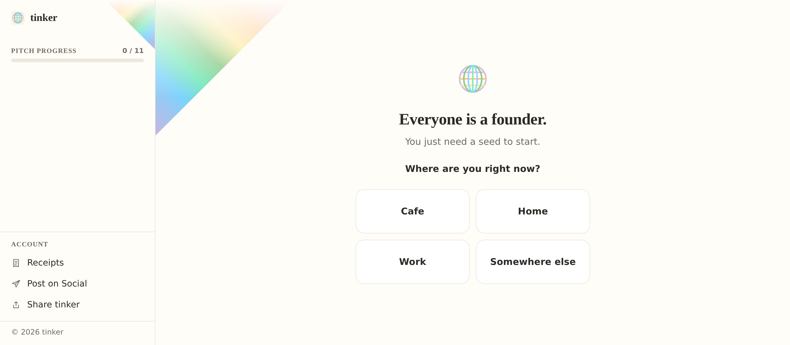

<!-- Export to PDF: npx @marp-team/marp-cli@latest pitch-deck.md --pdf --html -->

<!-- _class: cover -->

<svg xmlns="http://www.w3.org/2000/svg" viewBox="0 0 180 180" fill="none" role="img" aria-label="beginner seed mark"><rect width="180" height="180" rx="40" fill="#2d5a3d"/><path d="M68 38 L68 138" stroke="#f5f3ef" stroke-width="10.5" stroke-linecap="round"/><path d="M68 82 C68 68, 82 58, 100 58 C122 58, 132 72, 132 90 C132 108, 122 122, 100 122 C82 122, 68 112, 68 98Z" stroke="#f5f3ef" stroke-width="10.5" fill="none" stroke-linejoin="round"/><path d="M68 56 C66 44, 78 34, 92 38 C88 44, 74 50, 68 56Z" fill="#7bc47a"/><path d="M68 48 C67 42, 60 38, 54 40 C56 44, 64 47, 68 48Z" fill="#5aad58" opacity="0.7"/></svg>
beginner

# beginner

Everyone is a founder

Tyler Lindow · Founder & CEO of beginner 
Pre-seed · $500k

---

<!-- _class: team -->

<svg xmlns="http://www.w3.org/2000/svg" viewBox="0 0 180 180" fill="none" role="img" aria-label="beginner seed mark"><rect width="180" height="180" rx="40" fill="#2d5a3d"/><path d="M68 38 L68 138" stroke="#f5f3ef" stroke-width="10.5" stroke-linecap="round"/><path d="M68 82 C68 68, 82 58, 100 58 C122 58, 132 72, 132 90 C132 108, 122 122, 100 122 C82 122, 68 112, 68 98Z" stroke="#f5f3ef" stroke-width="10.5" fill="none" stroke-linejoin="round"/><path d="M68 56 C66 44, 78 34, 92 38 C88 44, 74 50, 68 56Z" fill="#7bc47a"/><path d="M68 48 C67 42, 60 38, 54 40 C56 44, 64 47, 68 48Z" fill="#5aad58" opacity="0.7"/></svg>
beginner

# Team

- Solo founder. 10 years building the bridge between makers and money.
- 6.5 years: payment tech, small-business onboarding · 3.5 years: museums &amp; education.
- The thread: never the gatekeeper, always the bridge.

---

<svg xmlns="http://www.w3.org/2000/svg" viewBox="0 0 180 180" fill="none" role="img" aria-label="beginner seed mark"><rect width="180" height="180" rx="40" fill="#2d5a3d"/><path d="M68 38 L68 138" stroke="#f5f3ef" stroke-width="10.5" stroke-linecap="round"/><path d="M68 82 C68 68, 82 58, 100 58 C122 58, 132 72, 132 90 C132 108, 122 122, 100 122 C82 122, 68 112, 68 98Z" stroke="#f5f3ef" stroke-width="10.5" fill="none" stroke-linejoin="round"/><path d="M68 56 C66 44, 78 34, 92 38 C88 44, 74 50, 68 56Z" fill="#7bc47a"/><path d="M68 48 C67 42, 60 38, 54 40 C56 44, 64 47, 68 48Z" fill="#5aad58" opacity="0.7"/></svg>
beginner

# Problem

> *Strong builders sometimes never become founders.*

> *The gap is fundraising — $500–$5,000 a month for a fractional coach or deck writer. The ones who can't pay stay builders.*

---

<!-- _class: tinker -->

<svg xmlns="http://www.w3.org/2000/svg" viewBox="0 0 200 200" fill="none" role="img" aria-label="tinker rainbow-web mark"><rect width="200" height="200" rx="44" fill="#F5F3EF"/><circle cx="100" cy="100" r="76" fill="none" stroke="#C8B6E2" stroke-width="9"/><line x1="24.06" y1="62.00" x2="175.94" y2="62.00" stroke="#F9A8D4" stroke-width="9" stroke-linecap="round"/><line x1="24.00" y1="100.00" x2="176.00" y2="100.00" stroke="#FDBA74" stroke-width="9" stroke-linecap="round"/><line x1="24.06" y1="138.00" x2="175.94" y2="138.00" stroke="#FDE68A" stroke-width="9" stroke-linecap="round"/><ellipse cx="100" cy="100" rx="52" ry="76" fill="none" stroke="#7BC47A" stroke-width="9"/><ellipse cx="100" cy="100" rx="26" ry="76" fill="none" stroke="#7DD3FC" stroke-width="9"/><line x1="100" y1="24" x2="100" y2="176" stroke="#6EE7B7" stroke-width="9" stroke-linecap="round"/></svg>
tinker

# Solution

> *A guided AI interview that turns conviction into a page seeders read. $9/mo entry. Same deliverable as the coach. 1/100th the price.*

---

<!-- _class: traction -->

<svg xmlns="http://www.w3.org/2000/svg" viewBox="0 0 180 180" fill="none" role="img" aria-label="beginner seed mark"><rect width="180" height="180" rx="40" fill="#2d5a3d"/><path d="M68 38 L68 138" stroke="#f5f3ef" stroke-width="10.5" stroke-linecap="round"/><path d="M68 82 C68 68, 82 58, 100 58 C122 58, 132 72, 132 90 C132 108, 122 122, 100 122 C82 122, 68 112, 68 98Z" stroke="#f5f3ef" stroke-width="10.5" fill="none" stroke-linejoin="round"/><path d="M68 56 C66 44, 78 34, 92 38 C88 44, 74 50, 68 56Z" fill="#7bc47a"/><path d="M68 48 C67 42, 60 38, 54 40 C56 44, 64 47, 68 48Z" fill="#5aad58" opacity="0.7"/></svg>
beginner

# Traction

10

paying users on tinker today. CAC: $9/user (excludes infra/scaling). At the $9/mo entry tier, LTV beats CAC inside month two.

---

<!-- _class: market -->

<svg xmlns="http://www.w3.org/2000/svg" viewBox="0 0 180 180" fill="none" role="img" aria-label="beginner seed mark"><rect width="180" height="180" rx="40" fill="#2d5a3d"/><path d="M68 38 L68 138" stroke="#f5f3ef" stroke-width="10.5" stroke-linecap="round"/><path d="M68 82 C68 68, 82 58, 100 58 C122 58, 132 72, 132 90 C132 108, 122 122, 100 122 C82 122, 68 112, 68 98Z" stroke="#f5f3ef" stroke-width="10.5" fill="none" stroke-linejoin="round"/><path d="M68 56 C66 44, 78 34, 92 38 C88 44, 74 50, 68 56Z" fill="#7bc47a"/><path d="M68 48 C67 42, 60 38, 54 40 C56 44, 64 47, 68 48Z" fill="#5aad58" opacity="0.7"/></svg>
beginner

# Market

$2.4B / year

<strong>1M aspiring founders globally × $2,400 / year</strong> (Enterprise + community tier ACV).

The aspiring-founder market is the people who already buy fundraising coaches, accelerator prep, and pitch tools — at the price point where beginner clears them all.

---

<!-- _class: ask -->

<svg xmlns="http://www.w3.org/2000/svg" viewBox="0 0 180 180" fill="none" role="img" aria-label="beginner seed mark"><rect width="180" height="180" rx="40" fill="#2d5a3d"/><path d="M68 38 L68 138" stroke="#f5f3ef" stroke-width="10.5" stroke-linecap="round"/><path d="M68 82 C68 68, 82 58, 100 58 C122 58, 132 72, 132 90 C132 108, 122 122, 100 122 C82 122, 68 112, 68 98Z" stroke="#f5f3ef" stroke-width="10.5" fill="none" stroke-linejoin="round"/><path d="M68 56 C66 44, 78 34, 92 38 C88 44, 74 50, 68 56Z" fill="#7bc47a"/><path d="M68 48 C67 42, 60 38, 54 40 C56 44, 64 47, 68 48Z" fill="#5aad58" opacity="0.7"/></svg>
beginner

# Ask

> *$500k → 4,000 paid users @ $9/mo (~$432k ARR) + 1 named accelerator deal in 12 months.*

<strong>$168k</strong> — founder cost (12 months: $150k base + $18k benefits). I need a salary; this is what it is.

<strong>$200k</strong> — founder events, travel, accelerator BD. SD farmers-market activations, EvoNexus / SDSU / UCSD / Nucleate partnerships, accelerator pipeline trips.

<strong>$132k</strong> — growth + infrastructure scaling. 4,000 users × $9 CAC = $36k paid; remainder covers funnel, community, and infra beyond a16z Speedrun credits.

Line in the sand: personal runway ends June 2026 — if the round doesn't close, I step away.

---

<!-- _class: closing -->

<svg xmlns="http://www.w3.org/2000/svg" viewBox="0 0 180 180" fill="none" role="img" aria-label="beginner seed mark"><rect width="180" height="180" rx="40" fill="#2d5a3d"/><path d="M68 38 L68 138" stroke="#f5f3ef" stroke-width="10.5" stroke-linecap="round"/><path d="M68 82 C68 68, 82 58, 100 58 C122 58, 132 72, 132 90 C132 108, 122 122, 100 122 C82 122, 68 112, 68 98Z" stroke="#f5f3ef" stroke-width="10.5" fill="none" stroke-linejoin="round"/><path d="M68 56 C66 44, 78 34, 92 38 C88 44, 74 50, 68 56Z" fill="#7bc47a"/><path d="M68 48 C67 42, 60 38, 54 40 C56 44, 64 47, 68 48Z" fill="#5aad58" opacity="0.7"/></svg>
beginner

<svg xmlns="http://www.w3.org/2000/svg" viewBox="0 0 200 200" fill="none" role="img" aria-label="tinker rainbow-web mark"><rect width="200" height="200" rx="44" fill="#F5F3EF"/><circle cx="100" cy="100" r="76" fill="none" stroke="#C8B6E2" stroke-width="9"/><line x1="24.06" y1="62.00" x2="175.94" y2="62.00" stroke="#F9A8D4" stroke-width="9" stroke-linecap="round"/><line x1="24.00" y1="100.00" x2="176.00" y2="100.00" stroke="#FDBA74" stroke-width="9" stroke-linecap="round"/><line x1="24.06" y1="138.00" x2="175.94" y2="138.00" stroke="#FDE68A" stroke-width="9" stroke-linecap="round"/><ellipse cx="100" cy="100" rx="52" ry="76" fill="none" stroke="#7BC47A" stroke-width="9"/><ellipse cx="100" cy="100" rx="26" ry="76" fill="none" stroke="#7DD3FC" stroke-width="9"/><line x1="100" y1="24" x2="100" y2="176" stroke="#6EE7B7" stroke-width="9" stroke-linecap="round"/></svg>
tinker

# Thank you

Everyone is a founder

